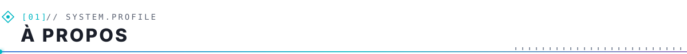
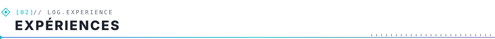
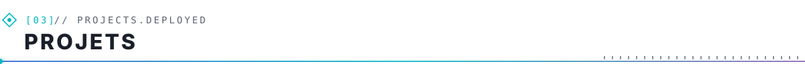
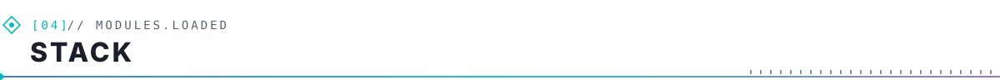
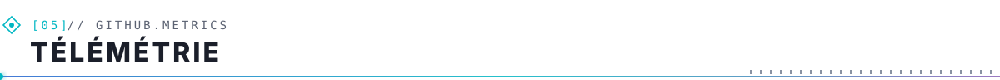
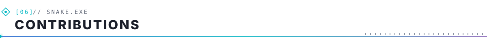
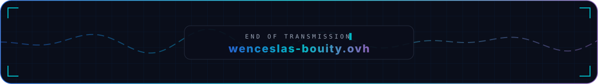

<div align="center">

<picture>
  <source media="(prefers-color-scheme: dark)" srcset="assets/hero-dark.svg" />
  <source media="(prefers-color-scheme: light)" srcset="assets/hero-light.svg" />
  
</picture>


<a href="https://wenceslas-bouity.ovh"></a>
<a href="https://github.com/Wens10?tab=followers"></a>
<a href="https://www.linkedin.com/in/wenceslas-jude-bouity-905430331/"></a>


</div>

<br />

<picture>
  <source media="(prefers-color-scheme: dark)" srcset="assets/section-01-dark.svg" />
  
</picture>

```ts
// > cat ./wenceslas.config.ts
export const wenceslas: Developer = {
  role:       "Développeur IA générative — LLM & agents IA · full stack",
  base:       "Paris, Île-de-France 🇫🇷 — mobile partout en France",
  school:     "Bachelor 3 Intelligence Artificielle @ ECE Paris",
  lookingFor: "Alternance 2026–2027 · 3 sem. entreprise / 2 sem. école",
  building:   ["assistants IA", "agents IA", "automatisation de processus"],
  pipeline:   ["analyse du besoin", "prototype", "architecture propre", "livraison"],
  alsoAt:     "CréaWebix — co-fondateur & DG",
  status:     "ONLINE",
} as const;
```

> **Mission :** intégrer les LLM dans des outils concrets pour les métiers. Après un **BTS SIO option SLAM** et des expériences en développement full stack, administration système et support de production, je construis des **assistants, des agents IA et des automatisations**.
>
> **→ Parcours complet et projets : [wenceslas-bouity.ovh](https://wenceslas-bouity.ovh)**

<picture>
  <source media="(prefers-color-scheme: dark)" srcset="assets/section-02-dark.svg" />
  
</picture>

| `TIMESTAMP` | `NODE` | `RÔLE` | `OUTPUT` |
|---|---|---|---|
| `2025` | **Learneo** · Paris | Développeur Full Stack / Data | Analyse du besoin, reprise des données, modélisation MySQL, développement full stack (JS · Bootstrap · MySQL) |
| `2024` | **BI & GEO IT Consulting** · Luxembourg | Admin Système & Réseau | Automatisation du déploiement de VM (vSphere · PowerCLI), configuration réseau |
| `2023` | **Transit Express** · Pointe-Noire | Application Production Support | Gestion d'incidents (ServiceNow), CI/CD (Ansible · Jenkins), daily meetings Agile |
| `∞` | **CréaWebix** | Co-fondateur & DG | Pilotage de projets web clients : besoin, planning, livraison |

<picture>
  <source media="(prefers-color-scheme: dark)" srcset="assets/section-03-dark.svg" />
  
</picture>

| `ID` | Projet | Description | Stack | Accès |
|---|---|---|---|---|
| `0x01` | **Prestalia** | Plateforme de réservation clients / prestataires — API REST, travail en équipe | Node.js · TypeScript · SQLite | `projet académique` |
| `0x02` | **Prestalia Desktop** | Application d'administration connectée à la même base et à la même API | C# · WinUI 3 | `projet académique` |
| `0x03` | **CodeNova** | Projet réalisé en hackathon | TypeScript | [live](https://codenova-indol.vercel.app) · [code](https://github.com/Wens10/HACKATON1) |
| `0x04` | **Face2flow** | Application web | HTML · CSS · JS | [live](https://face2flow.vercel.app) · [code](https://github.com/Wens10/Face2flow) |
| `0x05` | **PerfectSMELL** | Site e-commerce de vente de parfums | HTML · CSS · JS | [live](https://perfectsmell.vercel.app) · [code](https://github.com/Wens10/PerfectSMELL) |
| `0x06` | **Elykia ONG** | Site vitrine pour une ONG | HTML · CSS · JS | [live](https://elykia-ong.vercel.app) · [code](https://github.com/Wens10/Elykia_ong) |

<picture>
  <source media="(prefers-color-scheme: dark)" srcset="assets/section-04-dark.svg" />
  
</picture>

<div align="center">

`// IA & DATA`


`// FRONTEND`


`// BACKEND & DATA`


`// DEVOPS & AUTOMATISATION`


</div>

<picture>
  <source media="(prefers-color-scheme: dark)" srcset="assets/section-05-dark.svg" />
  
</picture>

<div align="center">

<picture>
  <source media="(prefers-color-scheme: dark)" srcset="https://raw.githubusercontent.com/Wens10/Wens10/output/github-stats-dark.svg" />
  
</picture>
<picture>
  <source media="(prefers-color-scheme: dark)" srcset="https://streak-stats.demolab.com/?user=Wens10&amp;hide_border=true&amp;background=0A0E1A&amp;ring=00B7C3&amp;fire=8764B8&amp;currStreakNum=F3F6FB&amp;sideNums=F3F6FB&amp;currStreakLabel=00B7C3&amp;sideLabels=2564CF&amp;dates=99A3B5&amp;stroke=232B3D" />
  
</picture>

<picture>
  <source media="(prefers-color-scheme: dark)" srcset="https://raw.githubusercontent.com/Wens10/Wens10/output/top-languages-dark.svg" />
  
</picture>

<sub><code>// activité publique uniquement · régénéré automatiquement chaque nuit</code></sub>

</div>

<picture>
  <source media="(prefers-color-scheme: dark)" srcset="assets/section-06-dark.svg" />
  
</picture>

<div align="center">

<picture>
  <source media="(prefers-color-scheme: dark)" srcset="https://raw.githubusercontent.com/Wens10/Wens10/output/github-snake-dark.svg" />
  <source media="(prefers-color-scheme: light)" srcset="https://raw.githubusercontent.com/Wens10/Wens10/output/github-snake.svg" />
  
</picture>

<br /><br />

**Une alternance en IA générative à proposer ? Ouvrons un canal.**

<a href="https://wenceslas-bouity.ovh"></a>
<a href="https://www.linkedin.com/in/wenceslas-jude-bouity-905430331/"></a>
<a href="mailto:judebouity19@gmail.com"></a>

<br /><br />

<picture>
  <source media="(prefers-color-scheme: dark)" srcset="assets/footer-dark.svg" />
  <source media="(prefers-color-scheme: light)" srcset="assets/footer-light.svg" />
  
</picture>

</div>
